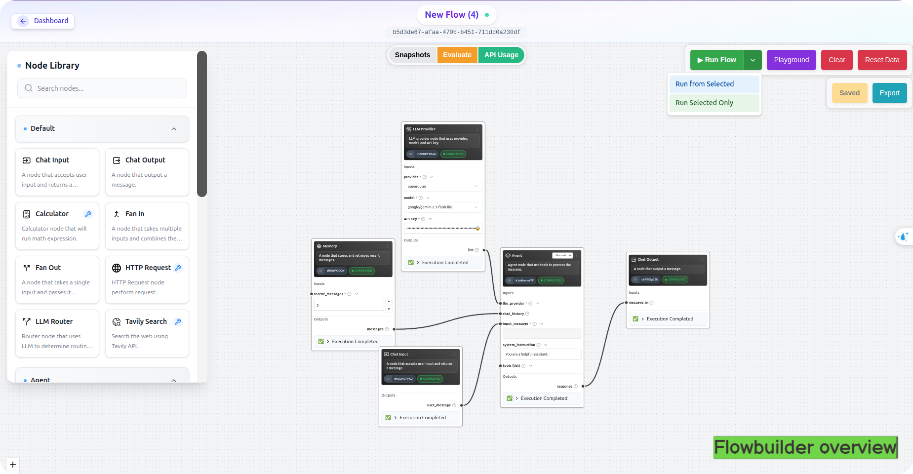
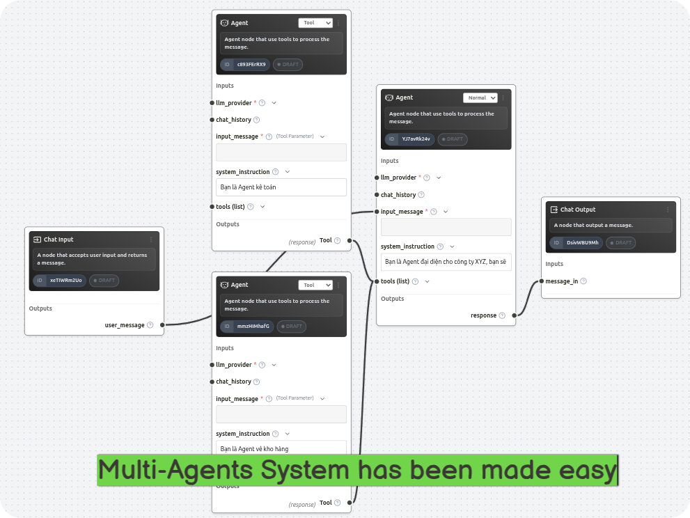
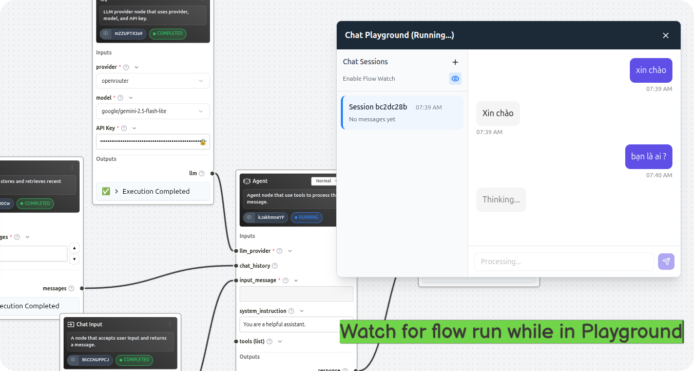
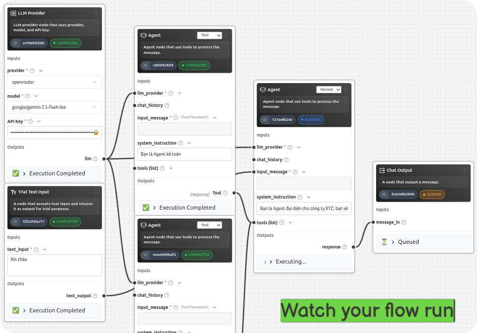
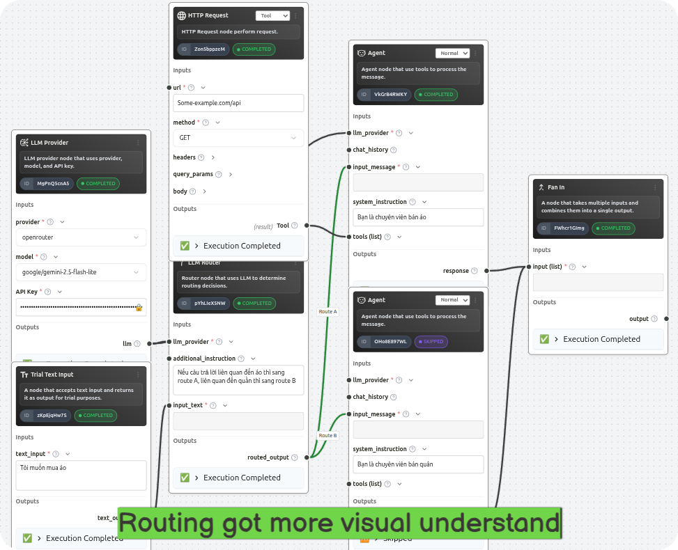
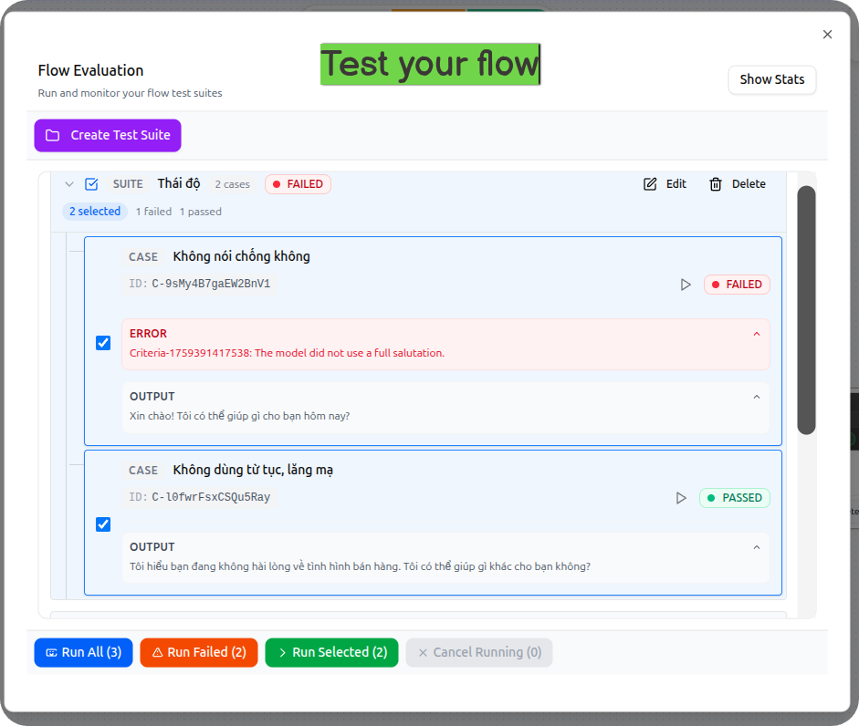

# Flowuni

<div align="center">



**A Visual AI Workflow Builder Platform**

Build, test, and deploy multi-agent AI workflows with an intuitive drag-and-drop interface.

[](LICENSE)
[](https://www.python.org/downloads/)
[](https://react.dev/)
[](https://fastapi.tiangolo.com/)

</div>

---

## ✨ Features

### 🎨 Visual Flow Builder
Create complex AI workflows using an intuitive drag-and-drop interface. Build multi-agent systems without writing code.

### 🤖 Multi-Agent Architecture
Design sophisticated multi-agent patterns including:
- **Sequential Pipelines** - Chain LLM operations in sequence
- **Orchestrator-Worker** - Task decomposition with specialized workers
- **Maker-Checker** - Quality assurance loops
- **Debate + Arbiter** - Multi-perspective decision making
- **Handoff Routing** - Skill-based agent selection



### 🔧 Extensible Node System
Choose from a rich catalog of pre-built nodes or create custom ones:

| Node Type | Description |
|-----------|-------------|
| **LLM Provider** | Connect to OpenAI, Google Vertex AI, or custom endpoints |
| **Embedding Provider** | Generate embeddings with Pinecone or Weaviate |
| **Agent Node** | Build autonomous AI agents with tools and memory |
| **Router Node** | Intelligent routing based on rules or LLM policies |
| **Aggregator Node** | Combine multiple outputs with various strategies |
| **Memory Node** | Persistent context and state management |
| **Tool Nodes** | HTTP requests, calculations, string transformations |

### 🧪 Playground & Testing
Test your flows in real-time with the built-in playground. Run individual nodes or execute entire workflows with live monitoring.



### 📊 Real-time Execution Monitoring
Watch your flows execute in real-time with WebSocket-powered updates. Track node status, view outputs, and debug issues instantly.



### 🔄 Smart Execution Strategies
- **Full Execution** - Run the entire flow from start to finish
- **Start from Node** - Resume execution from any point using cached data
- **Test Suites** - Create comprehensive test cases for your flows



### 📝 Flow Testing & Validation
Create test suites with multiple test cases to validate your workflows. Track test runs and analyze results over time.



---

## 🏗️ Architecture

### System Overview
FlowUni is built with a modern microservices architecture:

```
┌─────────────────────────────────────────────────────────────┐
│                         Frontend                            │
│                    (React + TypeScript)                    │
│                     + shadcn/ui + ReactFlow                │
└────────────────────────┬────────────────────────────────────┘
                         │ HTTP
                         ▼
┌─────────────────────────────────────────────────────────────┐
│                       Backend API                           │
│                      (FastAPI + Python)                      │
└────────────────────────┬────────────────────────────────────┘
                         │
        ┌────────────────┼────────────────┐
        ▼                ▼                ▼
┌──────────────┐ ┌──────────────┐ ┌──────────────┐
│  PostgreSQL  │ │    Redis     │ │ Event Service│
│   Database   │ │   Cache      │ │   (Worker)   │
└──────────────┘ └──────────────┘ └──────────────┘
```

---

## 🚀 Quick Start

### Prerequisites
- Docker & Docker Compose
- Python 3.11+
- Node.js 18+
- pnpm

### Installation

1. **Clone the repository**
   ```bash
   git clone https://github.com/huanidz/flowuni.git
   cd flowuni
   ```

2. **Configure environment**
   ```bash
   cp .env.example .env
   # Edit .env with your configuration
   ```

3. **Start development environment**
   ```bash
   ./commands/launch_dev.sh
   ```

This will start:
- Backend API on `http://localhost:8000`
- Frontend on `http://localhost:5173`
- PostgreSQL database
- Redis cache
- Event service worker

### First Steps

1. **Open the application** at `http://localhost:5173`
2. **Create a new flow** from the dashboard
3. **Add nodes** from the node catalog
4. **Connect nodes** by dragging between handles
5. **Configure nodes** by clicking on them
6. **Run your flow** using the playground

---

## 📖 Usage

### Creating a Simple Chat Flow

1. Create a new flow
2. Add an **LLM Provider** node
3. Add an **Agent** node
4. Connect the LLM Provider to the Agent
5. Configure the Agent with a system prompt
6. Run the flow in the playground

### Building a Multi-Agent System

1. Add a **Router** node
2. Create multiple **Agent** nodes with different specialties
3. Add an **Aggregator** node to combine results
4. Connect nodes to form your desired pattern
5. Test with various inputs

### Creating Test Suites

1. Open your flow
2. Navigate to the "Tests" tab
3. Create test cases with input data
4. Run all tests to validate your flow
5. View test results and fix any issues

---

## 🧩 Node Catalog

### Core Nodes

#### LLM Provider Node
Connect to LLM services (OpenAI, Vertex AI, custom endpoints).

#### Agent Node
Build autonomous agents with:
- System prompts
- Tool access
- Memory integration
- Reflection capabilities

#### Router Node
Intelligent routing with:
- Rule-based routing
- LLM-based routing
- Fan-out capabilities
- Topic-based filtering

#### Aggregator Node
Combine outputs with strategies:
- First wins
- Vote/consensus
- Score-based selection
- Custom reduce functions

#### Memory Node
Persistent context with backends:
- In-memory
- Vector stores (Pinecone, Weaviate)
- Key-value stores
- Document stores

---

## 🤝 Contributing

Contributions are welcome! Please read our contributing guidelines before submitting PRs.

### Development Setup

```bash
# Backend
cd backend
pip install -r requirements.txt
alembic upgrade head
uvicorn src.main:app --reload

# Frontend
cd frontend
pnpm install
pnpm dev
```

---

## 📄 License

This project is licensed under the MIT License - see the [LICENSE](LICENSE) file for details.

---

## 🙏 Acknowledgments

- Built with [FastAPI](https://fastapi.tiangolo.com/)
- UI powered by [ReactFlow](https://reactflow.dev/)
- Components from [shadcn/ui](https://ui.shadcn.com/)

---

## 📞 Support

- 📧 Email: huannguyena2@gmail.com
- 🐛 Issues: [GitHub Issues](https://github.com/huanidz/flowuni/issues)
- 💬 Discussions: [GitHub Discussions](https://github.com/huanidz/flowuni/discussions)

---

<div align="center">

**Built with ❤️ for the AI community**

</div>
